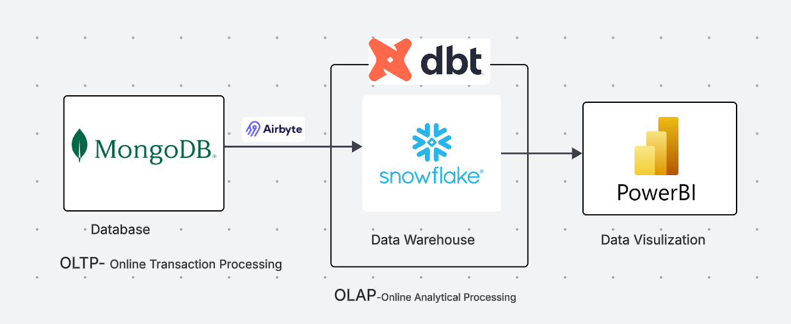
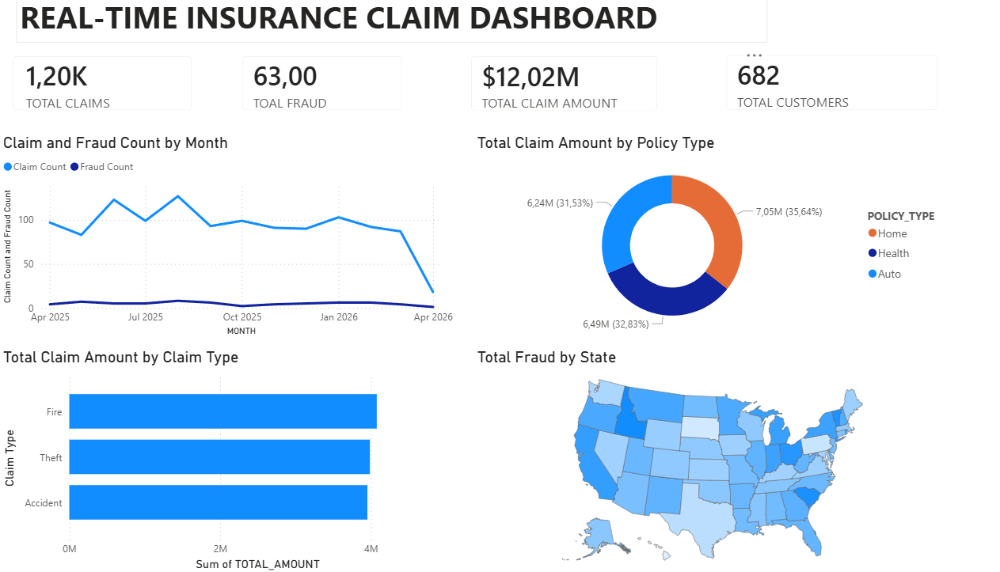

# 🚀 Real-Time Insurance Data Pipeline & Analytics Dashboard

## 📌 Overview

This project demonstrates a **modern data engineering pipeline** that simulates real-time insurance data, processes it through a cloud data stack, and visualizes insights using an interactive dashboard.

The dataset includes:

* Customers
* Policies
* Claims
* Fraud indicators

---

## Data Pipeline Architecture



### 🔄 Flow:

1. **Data Generation (Python + Faker)**

   * Simulates real-time insurance data (customers & claims)

2. **NoSQL Storage (MongoDB)**

   * Stores semi-structured data (OLTP)

3. **Data Ingestion (Airbyte)**

   * Extracts data from MongoDB
   * Loads into Snowflake (ELT pipeline)

4. **Data Warehouse (Snowflake)**

   * Central storage for analytics (OLAP)

5. **Transformation (dbt)**

   * Cleans and transforms raw data
   * Creates analytics-ready models

6. **Visualization (Power BI)**

   * Interactive dashboard for insights

---

## ⚙️ Tech Stack

* 🟢 MongoDB (NoSQL Database)
* 🔵 Airbyte (Data Integration)
* ❄️ Snowflake (Cloud Data Warehouse)
* 🧱 dbt (Data Transformation)
* 📊 Power BI (Data Visualization)
* 🐍 Python (Data Simulation)

---

## 📊 Dashboard Preview



### Key Insights:

* 📈 Total Claims Over Time
* 🚨 Fraud Detection Trends
* 💰 Total Claim Amount
* 👥 Customer Distribution
* 🏠 Policy Type Breakdown
* 🗺️ Fraud by State

---

## 🔁 Project Workflow

```text
Python (Faker)
      ↓
MongoDB (NoSQL)
      ↓
Airbyte (ELT)
      ↓
Snowflake (Warehouse)
      ↓
dbt (Transformations)
      ↓
Power BI (Dashboard)
```

---

## 📂 Project Structure

```text
insurance-pipeline-project/
│
├── data-generator/        # Python real-time data generator
├── airbyte/               # Airbyte configs (optional)
├── dbt_project/           # dbt models & transformations
├── dashboard/             # Power BI file
├── images/                # Architecture & dashboard images
└── README.md
```

---

## 🚀 Features

* ✅ Real-time data simulation
* ✅ End-to-end ELT pipeline
* ✅ NoSQL → Data Warehouse integration
* ✅ Scalable cloud architecture
* ✅ Analytics-ready data modeling
* ✅ Interactive BI dashboard

---

## 🧠 Use Cases

* Fraud detection analytics
* Insurance claim monitoring
* Customer behavior analysis
* Real-time data pipeline demonstration

---

## ⚡ Getting Started

### 1. Clone the repo

```bash
git clone https://github.com/your-username/insurance-pipeline-project.git
cd insurance-pipeline-project
```

### 2. Run Data Generator

```bash
python simulator.py
```

### 3. Setup Airbyte

* Connect MongoDB as source
* Connect Snowflake as destination
* Start sync

### 4. Run dbt Models

```bash
dbt run
```

### 5. Open Power BI Dashboard

* Load the `.pbix` file
* Connect to Snowflake

---

## 🔮 Future Improvements

* Streaming with Kafka
* Real-time fraud detection models
* CI/CD for data pipelines
* Data quality monitoring

---

## 👨‍💻 Author

**Zerihun Waje**

---

## ⭐ If you like this project

Give it a ⭐ on GitHub!
